# vscode-code-review
<!-- ALL-CONTRIBUTORS-BADGE:START - Do not remove or modify this section -->
[](#contributors-)
<!-- ALL-CONTRIBUTORS-BADGE:END -->

<a href="https://www.buymeacoffee.com/dkoppenhagen" target="_blank"></a>

[](https://marketplace.visualstudio.com/items?itemName=d-koppenhagen.vscode-code-review)
[](https://open-vsx.org/extension/d-koppenhagen/vscode-code-review)
[](http://makeapullrequest.com)
[](https://github.com/ellerbrock/open-source-badge/)

This extension allows you to create a code review file you can hand over to a customer.

<hr>

- [Features](#features)
  - [create review notes](#create-review-notes)
  - [Code Review Comment Explorer - update, view and delete comments](#code-review-comment-explorer---update-view-and-delete-comments)
  - [export created notes as HTML](#export-created-notes-as-html)
    - [Default template](#default-template)
    - [Custom handlebars template](#custom-handlebars-template)
  - [Export for Issue Tracking System](#export-for-issue-tracking-system)
    - [export created notes as GitLab importable CSV file](#export-created-notes-as-gitlab-importable-csv-file)
    - [export created notes as GitHub importable CSV file](#export-created-notes-as-github-importable-csv-file)
    - [export created notes as JIRA importable CSV file](#export-created-notes-as-jira-importable-csv-file)
- [Extension Settings](#extension-settings)
  - [`code-review.filename`](#code-reviewfilename)
  - [`code-review.baseUrl`](#code-reviewbaseurl)
  - [`code-review.customUrl`](#code-reviewcustomurl)
  - [`code-review.groupBy`](#code-reviewgroupby)
  - [`code-review.categories`](#code-reviewcategories)
  - [`code-review.reportWithCodeSelection`](#code-reviewreportwithcodeselection)
  - [`code-review.reportWithPrivateComments`](#code-reviewreportwithprivatecomments)
  - [`code-review.privateCommentIcon`](#code-reviewprivatecommenticon)
  - [`code-review.defaultTemplatePath`](#code-reviewdefaulttemplatepath)
  - [`code-review.priorities`](#code-reviewpriorities)
  - [`code-review.vcs.git.provider`](#code-reviewvcsgitprovider)
  - [`code-review.vcs.git.directory`](#code-reviewvcsgitdirectory)
  - [`code-review.filterCommentsByCommit`](#code-reviewfiltercommentsbycommit)
  - [`code-review.filterCommentsByFilename`](#code-reviewfiltercommentsbyfilename)
  - [`code-review.importBackup`](#code-reviewimportbackup)
  - [`code-review.importConflictMode`](#code-reviewimportconflictmode)
  - [`code-review.importCloneSuffix`](#code-reviewimportclonesuffix)
  - [`code-review.codeSelectionBackgroundColor`](#code-reviewcodeselectionbackgroundcolor)
- [Themable colors](#themable-colors)
  - [`codereview.priority.green`](#codereviewprioritygreen)
  - [`codereview.priority.yellow`](#codereviewpriorityyellow)
  - [`codereview.priority.red`](#codereviewpriorityred)
  - [`codereview.code.selection.background`](#codereviewcodeselectionbackground)
- [Keybindings](#keybindings)
- [The review approach](#the-review-approach)
- [Contributors ✨](#contributors-)

<hr>

## Features

### create review notes

Simply right click somewhere in the opened file and choose the option "Code Review: Add Note".
You will be prompted for your note you wanna add.
A file `code-review.csv` will be created containing your comments and the file and line references.

The result will look like this:

```csv
revision,filename,url,lines,title,comment,priority,additional
"b45d2822d6c87770af520d7e2acc49155f0b4362","/test/a.txt","https://github.com/d-koppenhagen/vscode-code-review/tree/b45d2822d6c87770af520d7e2acc49155f0b4362/test/a.txt","1:2-4:3","foo","this should be refactored","Complexity",1,"see http://foo.bar"
"b45d2822d6c87770af520d7e2acc49155f0b4362","/test/b.txt","https://github.com/d-koppenhagen/vscode-code-review/tree/b45d2822d6c87770af520d7e2acc49155f0b4362/test/b.txt","1:0-1:4|4:0-4:3","bar","wrong format","Best Practices",1,""
```

The line column indicates an array of selected ranges or cursor positions separated by a `|` sign.
E.g. `"1:0-1:4|4:0-4:3"` means that the comment is related to the range marked from line 1 position 0 to line 1 position 4 and line 4 position 0 to line 4 position 3.

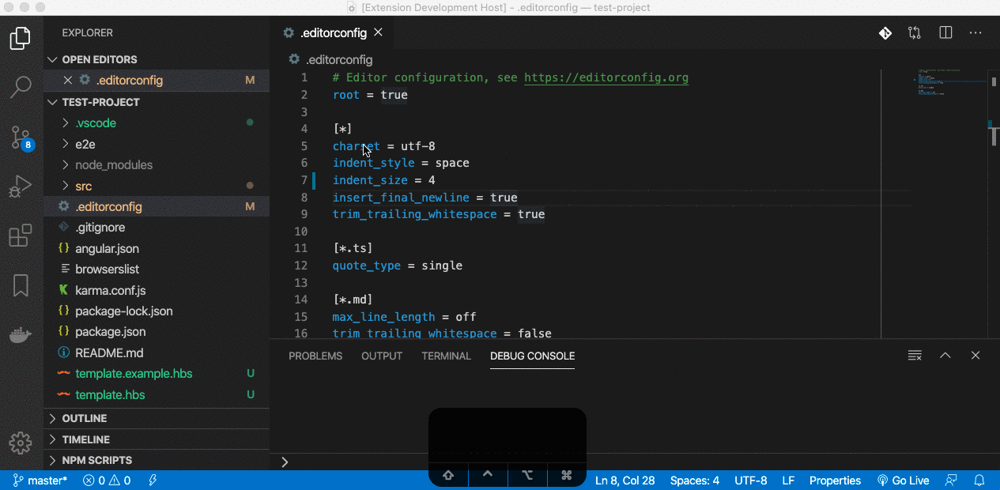

After adding a review note, your can directly edit and review it from the source by clicking on the annotation above the referenced lines(s).
Parts in the code that are already commented will be decorated by a small underline and by an icon at the end of the referenced code part.
You can also explore and edit/view all comments in the comment explorer (see below).

### Code Review Comment Explorer - update, view and delete comments

Once you created your first code review comment and the plugin can find the associated review file (by default `code-review.csv`), a new button will appear in the sidebar.
Clicking on this button will open the **Code Review Comment Explorer**.
This explorer shows you all made comments to the related code base.
Selecting an entry will open the comment in the webview form so you can edit and update it.
Performing a right-click on an item, will let you delete a comment.

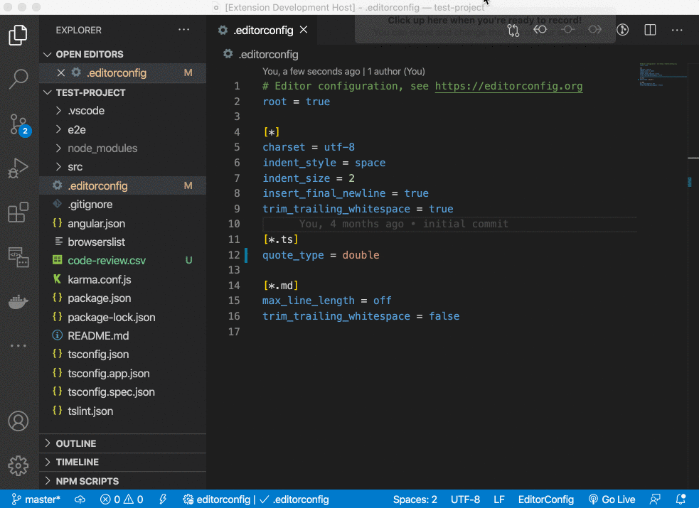

### export created notes as HTML

Once you finished your review and added your notes, you can export the results as an HTML report.
Therefore open the [VSCode Command Palette](https://code.visualstudio.com/docs/getstarted/tips-and-tricks#_command-palette) (macOS: ⇧+⌘+P, others: ⇧+Ctrl+P) and search for "Code Review":

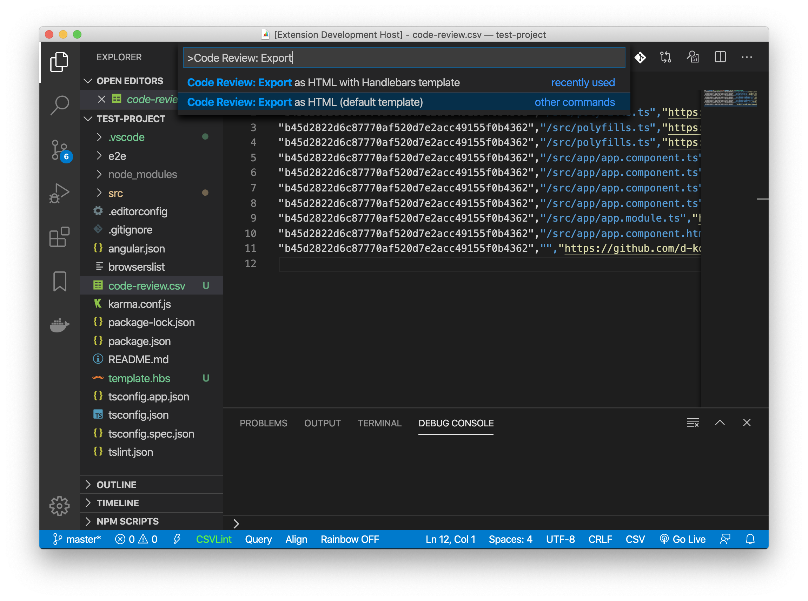

#### Default template

When you choose to generate the report using the default template, it will look like this in the end:

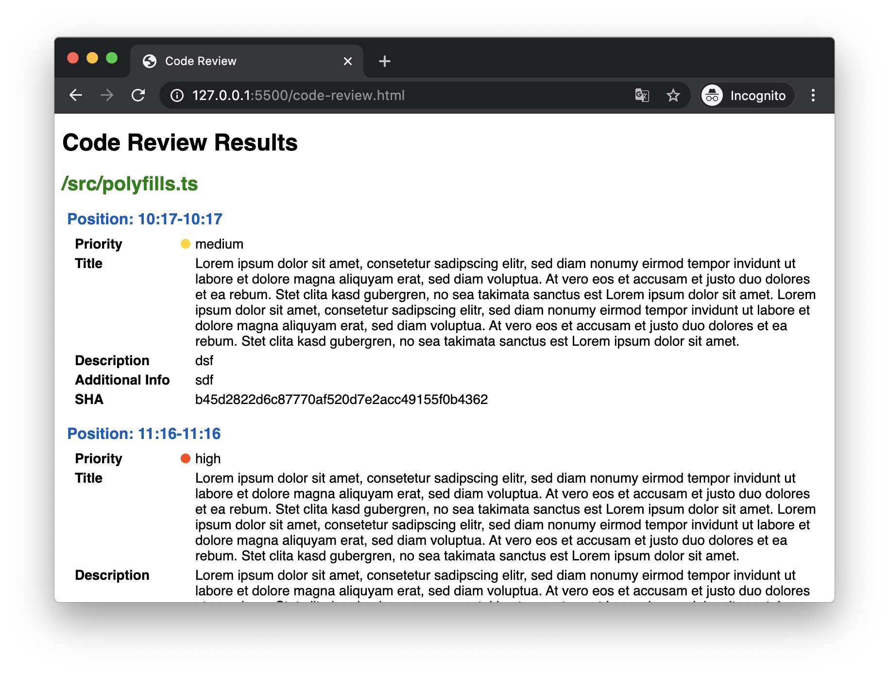

> You can define a path to a custom template that's used by default when running this command.
> Check out the [Extension Setting 'defaultTemplatePath'](#extension-settings) for further information.

#### Custom handlebars template

You can also choose to export the HTML report by using a custom [Handlebars](https://handlebarsjs.com/) template.
One you choose this option you cot prompted to choose the template file (file extension must be either `*.hbs`, `*.handlebars`, `*.html` or `*.htm`)

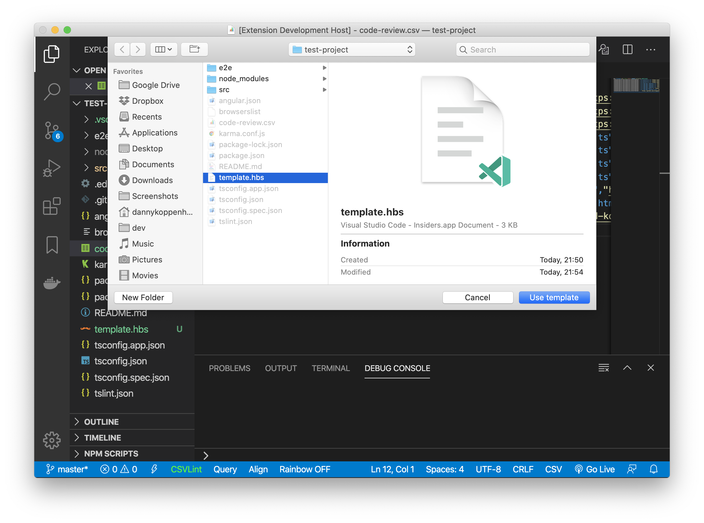

The used structure to fill the template placholders is an array of [`ReviewFileExportSection`](https://github.com/d-koppenhagen/vscode-code-review/blob/master/src/interfaces.ts#L31-L44).

Check out the example default template file
[`template.default.hbs`](https://github.com/d-koppenhagen/vscode-code-review/blob/master/src/template.default.hbs), to see how your template should basically look like.

### Export for Issue Tracking System

#### export created notes as GitLab importable CSV file

Once you finished your code review, you can export the results to a formatted csv file that's [importable into Gitlab issues](https://docs.gitlab.com/ee/user/project/issues/csv_import.html).

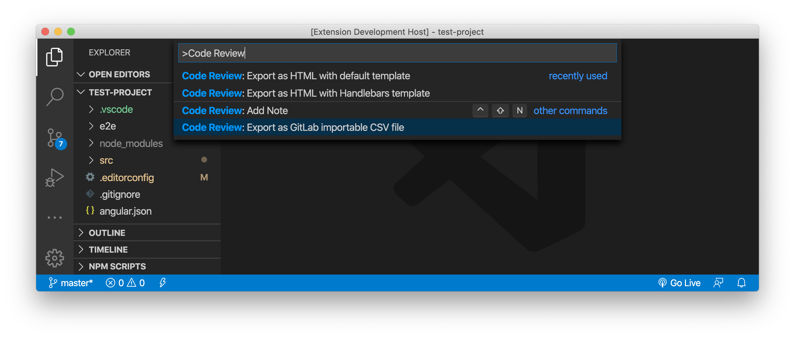

Once exported, you can import the file in the GitLab project

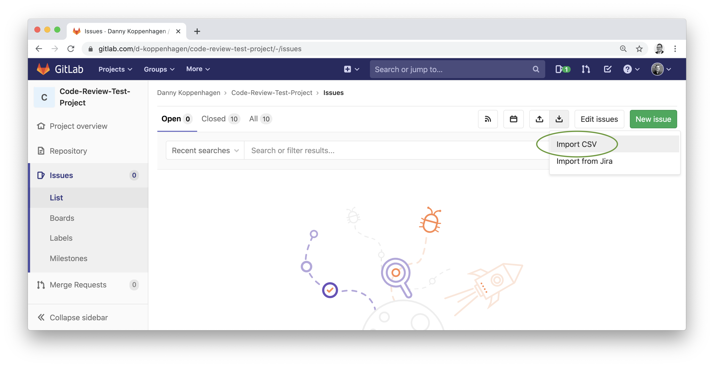

#### export created notes as GitHub importable CSV file

You can export the code review results to a formatted csv file that's [importable into GitHub by using `github-csv-tools`](https://github.com/gavinr/github-csv-tools).

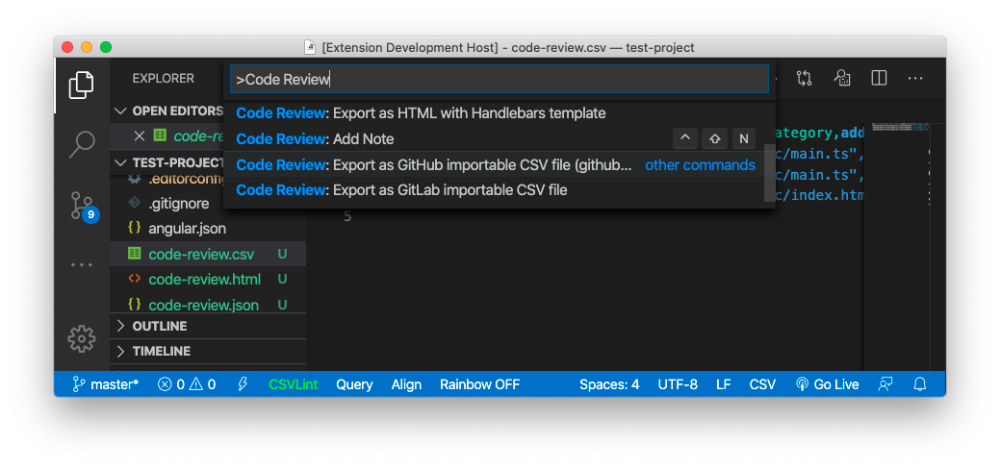

#### export created notes as JIRA importable CSV file

You can also export the notes as a CSV file to [import them into your JIRA issue tracking system](https://confluence.atlassian.com/adminjiracloud/importing-data-from-csv-776636762.html).

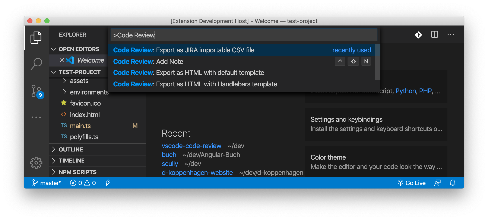

After exporting, you can import the file in your JIRA instance and probably map the props / ignore what you don't need:

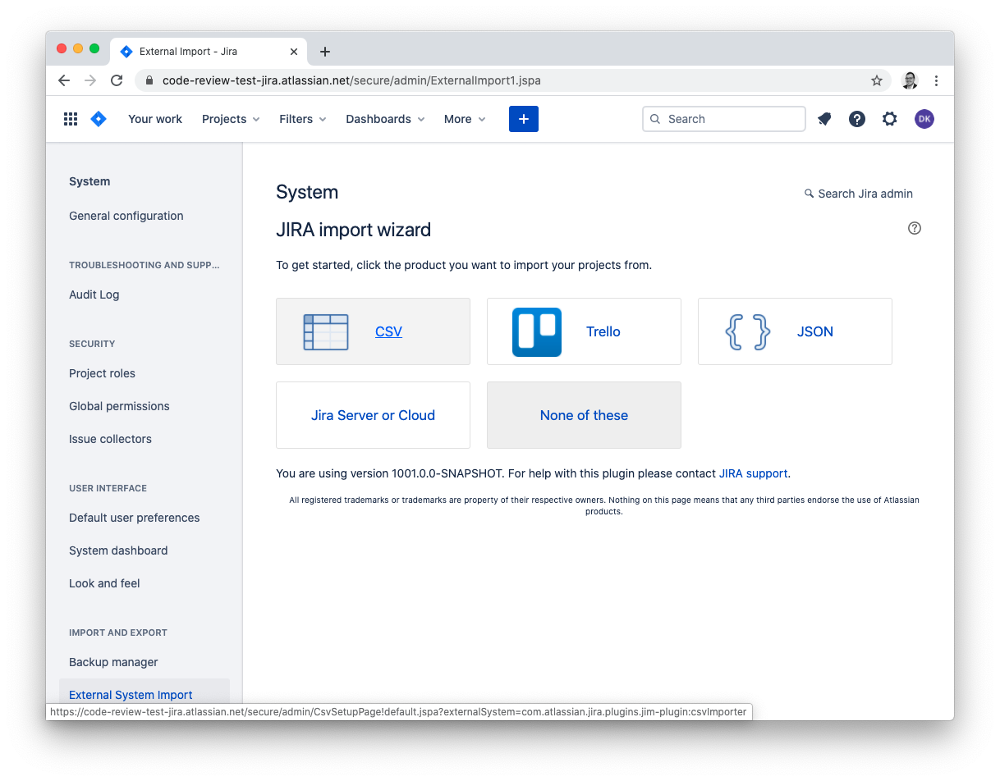
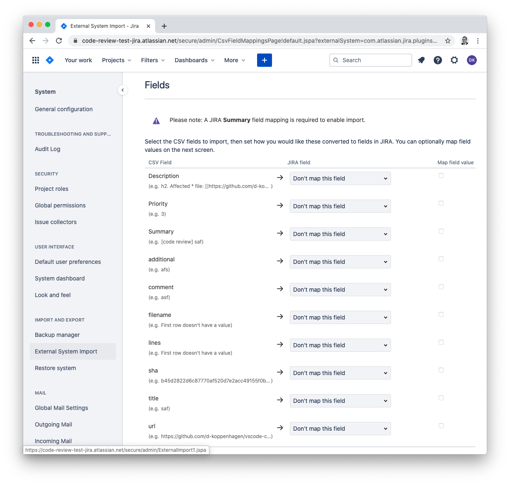

## Extension Settings

The following settings can be adjusted via the configuration file `.vscode/settings.json` or globally when configuring vscode.
The listing below shows the default configuration:

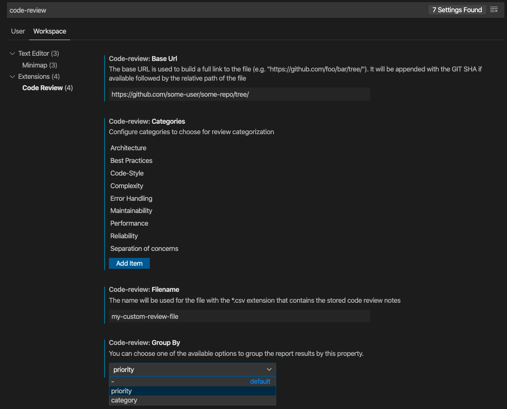

### `code-review.filename`

The filename for the `*.csv` file that stores all comments.
By default `"code-review"` is used.

```json
{
  "code-review.filename": "my-review-file"
}
```

### `code-review.baseUrl`

The base-URL is used to build a full link to the file.
It will be appended with the revision if available followed by the relative path of the file and the selected lines as an anchor.
This setting is skipped when the setting `code-review.customUrl` is defined which is more configurable.

```json
{
  "code-review.baseUrl": "https://github.com/foo/bar/blob"
}
```

This setting would lead into something like this: `https://github.com/foo/bar/blob/b0b4...0175/src/file.txt#L12-L19`.

### `code-review.customUrl`

The custom URL is used to build a full link to the file.
The following placeholders are available:

- `{revision}`: insert the file's revision
- `{file}`: insert the file name/path
- `{start}`: insert the start of the lines selection as an anchor
- `{end}`: insert the end of the lines selection as an anchor

```json
{
  "code-review.customUrl": "https://gitlab.com/foo/bar/baz/-/blob/{revision}/src/{file}#L{start}-{end}"
}
```

This setting would lead into something like this: `https://gitlab.com/foo/bar/baz/-/blob/b0b4...0175/src/file.txt#L12-19`

### `code-review.groupBy`

This setting is used when [generating a report](#export-created-notes-as-html).
The comments will be grouped by either:

- `filename`: default, group by filename
- `priority`: grouping by priorities
- `category`: grouping by the used categories

```json
{
  "code-review.groupBy": "category"
}
```

### `code-review.categories`

Here you can define the categories that will be available for selection when you create comments.

```json
{
  "code-review.categories": [
      "Architecture",
      "Best Practices",
      ...
  ],
}
```

### `code-review.reportWithCodeSelection`

Define whether to include the code selection(s) in generated reports or not.

```json
{
  "code-review.reportWithCodeSelection": true
}
```

> Attention! The code included in the report will be BASE64 encoded in order to prevent breaking report generation by unescaped characters that will be accidentally interpreted.
You can decode this by using the provided Handlebars helper function **`codeBlock`** as shown below:

```hbs
{{#each this as |item|}}
<section>
  {{#each item.lines as |line|}}
  <div>
    <!-- ... -->
    {{#if line.code}}
    <pre><code>{{codeBlock line.code}}</code></pre>
    {{/if}}
    <!-- ... -->
  </div>
  {{/each}}
</section>
{{/each}}
```

### `code-review.reportWithPrivateComments`

Define whether to include private comments in generated reports or not.

```json
{
  "code-review.reportWithPrivateComments": true
}
```

### `code-review.privateCommentIcon`

Identifier of the icon to show next to a private comment.
The available icons are listed in <https://code.visualstudio.com/api/references/icons-in-labels#icon-listing>.
A search engine can be found at <https://microsoft.github.io/vscode-codicons/dist/codicon.html>.

```json
{
  "code-review.privateCommentIcon": "eye-closed"
}
```

### `code-review.defaultTemplatePath`

The path to a default Handlebars template to be used for HTML default export.
The template is used by default when choosing [_'Export as HTML with default template'_](#export-created notes-as-html) extension command.
If not set, the out-of-the-box template provided by this extension is used.
The configured value must be the full path to the Handlebars template file.

```json
{
  "code-review.defaultTemplatePath": "/Users/my-user/my-code-review-template.hbs"
}
```

### `code-review.priorities`

Configure the labels that should be used for the priorities.
The first label is used when no priority is defined. The subsequent labels are given in ascending priority (max. 3 priority levels).
The defaults are listed below:

```json
{
  "code-review.priorities": [
    "none",   // prio not defined
    "low",    // prio value 1 = green traffic light selected
    "medium", // prio value 2 = yellow traffic light selected
    "high"    // prio value 3 = red traffic light selected
  ] // list must contain exact 4 items
}
```

### `code-review.vcs.git.provider`

Permits selecting the version control system (VCS) used by your repositories.
The default is git, but svn and git-svn are also supported.

Note on git-svn: This provider is kind of a hybrid. It extracts the svn file revision through the git-svn-cloned repository.
Use case for this provider is an only temporarily available svn repository (e.g., only accessible from a certain
physical location, like an offline-in-house network) that has been locally cloned with git-svn. The interesting revision
number then is not the git sha as it this is only local information, but the underlying svn revision information. 

### `code-review.vcs.git.directory`

Use this setting when the Git repository is located in an other directory than the workspace one.
The path can be **relative** (prefixed with `.` or `..`) or **absolute** (prefixed with `/` on Linux/MacOS or `{drive}:\` on Windows).

Examples:

- `./app`: for {workspace}/app (Linux/MacOS)

  ```json
  {
    "code-review.vcs.git.directory": "./app"
  }
  ```

- `../app`: for a folder at the same level as the workspace (Linux/MacOS)

  ```json
  {
    "code-review.vcs.git.directory": "../app"
  }
  ```

- `/path/to/my/app`: for an absolute path (Linux/MacOS)

  ```json
  {
    "code-review.vcs.git.directory": "/path/to/my/app"
  }
  ```

- `C:\Path\To\My\App`: for an absolute path (Windows)

  ```json
  {
    "code-review.vcs.git.directory": "C:\\Path\\To\\My\\App"
  }
  ```

### `code-review.filterCommentsByCommit`

Define whether to view only the comments from the current commit or not.

```json
{
  "code-review.filterCommentsByCommit": true
}
```

### `code-review.filterCommentsByFilename`

Define whether to view only the comments from the current file or not.

```json
{
  "code-review.filterCommentsByFilename": true
}
```

### `code-review.importBackup`

Define whether to backup the existing comments before importing new ones or not

```json
{
  "code-review.importBackup": true
}
```

### `code-review.importConflictMode`

Action to automatically take when importing comments already present:

- *empty*: always ask.
- `skip`: keep the existing comment.
- `overwrite`: replace the existing comment with the imported one.
- `clone`: keep both the existing and the imported comments.

```json
{
  "code-review.importConflictMode": "clone"
}
```

### `code-review.importCloneSuffix`

Suffix to append to the title when existing comments are imported in [`clone`](#code-reviewimportconflictmode) mode.

```json
{
  "code-review.importCloneSuffix": "(copy)"
}
```

### `code-review.codeSelectionBackgroundColor`

Background color used to highlight the code associated to a comment.
Must be specified using a hexadecimal representation - with or without the alpha part (`#C8C832` or `#C8C83226`) - or a `rgba()` definition.

```json
{
  "code-review.codeSelectionBackgroundColor": "#C8C83226"
}
```

```json
{
  "code-review.codeSelectionBackgroundColor": "rgba(200, 200, 50, 0.15)"
}
```

## Themable colors

### `codereview.priority.green`

Color for comments with priority **level 1**.

### `codereview.priority.yellow`

Color for comments with priority **level 2**.

### `codereview.priority.red`

Color for comments with priority **level 3**.

### `codereview.code.selection.background`

Background color for highlighted code.

## Keybindings

To easily add a *new* comment, you can use the keybinding combination `ctrl` + ⇧ + `n`.

## The review approach

If you got a customer request for doing a code review you will ideally receive read access to it's github / gitlab repository or similar.
To create a code review with a report you should install this extension and go on with the following steps:

- Download / clone the customer code and checkout the correct branch
- Open the project in vscode
- [Configure the `baseURL` option](#extension-settings) with the remote URL
  - this will cause that the link in the report is generate with the correct target including revision, file and line reference
- [Start creating your review notes](#create-review-notes).
- [Export the report](#export-created-notes-as-html).
  - [Probably create an own template first](#custom-handlebars-template)
- Send it to the customer or [import the notes in your issue tracking system](#export-for-issue-tracking-system) and make the customer happy ♥️

**Enjoy!**

## Contributors ✨

Thanks goes to these wonderful people ([emoji key](https://allcontributors.org/docs/en/emoji-key)):

<!-- ALL-CONTRIBUTORS-LIST:START - Do not remove or modify this section -->
<!-- prettier-ignore-start -->
<!-- markdownlint-disable -->
<table>
  <tr>
    <td align="center"><a href="https://github.com/bluenick2k17"><br /><sub><b>Nick Dunne</b></sub></a><br /><a href="https://github.com/d-koppenhagen/vscode-code-review/commits?author=bluenick2k17" title="Code">💻</a></td>
    <td align="center"><a href="https://github.com/elazarcoh"><br /><sub><b>elazarcoh</b></sub></a><br /><a href="https://github.com/d-koppenhagen/vscode-code-review/commits?author=elazarcoh" title="Code">💻</a> <a href="https://github.com/d-koppenhagen/vscode-code-review/issues?q=author%3Aelazarcoh" title="Bug reports">🐛</a></td>
    <td align="center"><a href="https://fr.linkedin.com/in/michel-caradec-36997650"><br /><sub><b>Michel Caradec</b></sub></a><br /><a href="https://github.com/d-koppenhagen/vscode-code-review/commits?author=michelcaradec" title="Code">💻</a> <a href="#ideas-michelcaradec" title="Ideas, Planning, & Feedback">🤔</a> <a href="https://github.com/d-koppenhagen/vscode-code-review/issues?q=author%3Amichelcaradec" title="Bug reports">🐛</a> <a href="https://github.com/d-koppenhagen/vscode-code-review/commits?author=michelcaradec" title="Documentation">📖</a> <a href="https://github.com/d-koppenhagen/vscode-code-review/commits?author=michelcaradec" title="Tests">⚠️</a></td>
    <td align="center"><a href="http://k9n.dev"><br /><sub><b>Danny Koppenhagen</b></sub></a><br /><a href="https://github.com/d-koppenhagen/vscode-code-review/commits?author=d-koppenhagen" title="Code">💻</a> <a href="https://github.com/d-koppenhagen/vscode-code-review/commits?author=d-koppenhagen" title="Tests">⚠️</a> <a href="https://github.com/d-koppenhagen/vscode-code-review/pulls?q=is%3Apr+reviewed-by%3Ad-koppenhagen" title="Reviewed Pull Requests">👀</a> <a href="#maintenance-d-koppenhagen" title="Maintenance">🚧</a> <a href="#ideas-d-koppenhagen" title="Ideas, Planning, & Feedback">🤔</a> <a href="#example-d-koppenhagen" title="Examples">💡</a> <a href="https://github.com/d-koppenhagen/vscode-code-review/commits?author=d-koppenhagen" title="Documentation">📖</a> <a href="https://github.com/d-koppenhagen/vscode-code-review/issues?q=author%3Ad-koppenhagen" title="Bug reports">🐛</a></td>
    <td align="center"><a href="http://www.caero.de"><br /><sub><b>Carsten Rösnick-Neugebauer</b></sub></a><br /><a href="https://github.com/d-koppenhagen/vscode-code-review/issues?q=author%3Acroesnick" title="Bug reports">🐛</a></td>
  </tr>
</table>

<!-- markdownlint-restore -->
<!-- prettier-ignore-end -->

<!-- ALL-CONTRIBUTORS-LIST:END -->

This project follows the [all-contributors](https://github.com/all-contributors/all-contributors) specification. Contributions of any kind welcome!
